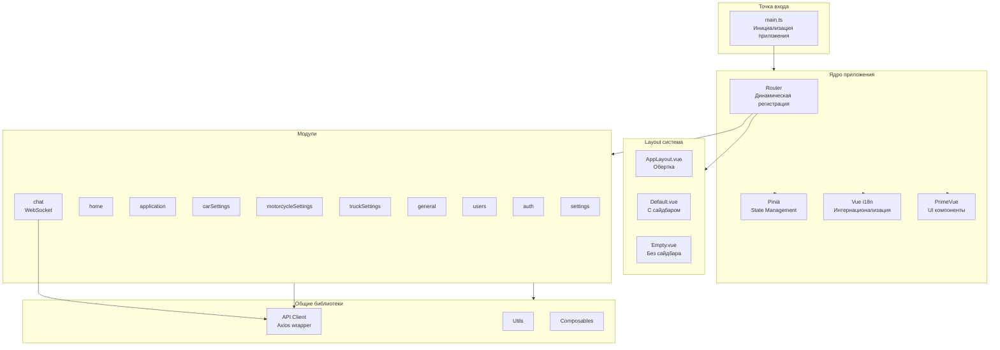

# Dubai Auto Admin

Административная панель для управления автомобильной платформой. Проект использует модульную архитектуру с Vue 3, TypeScript и современным стеком технологий.

## Технологический стек

- **Vue 3** с Composition API и `<script setup>`
- **TypeScript** для типобезопасности
- **Vite** как сборщик и dev-сервер
- **PrimeVue 4** - UI библиотека компонентов
- **Tailwind CSS** - утилитарный CSS фреймворк
- **Pinia** - управление состоянием
- **Vue Router 4** - роутинг с динамической регистрацией модулей
- **Vue i18n** - интернационализация (ru, en, tm)
- **Axios** - HTTP клиент
- **Vue3-cookies** - работа с cookies
- **Moment.js** - работа с датами
- **WebSocket** - реальное время для чата

## Требования

- Node.js 18+ (рекомендуется LTS версия)
- npm или yarn

## Установка и запуск

### Установка зависимостей

```bash
npm install
```

### Настройка окружения

Создайте файл `.env` в корне проекта:

```env
VITE_APP_BASE_URL=https://api.example.com
```

Где `VITE_APP_BASE_URL` - базовый URL вашего API сервера.

### Запуск разработки

```bash
npm run dev
```

Приложение будет доступно на `http://localhost:3333`

### Сборка для production

```bash
npm run build
```

### Просмотр production сборки

```bash
npm run preview
```

Приложение будет доступно на `http://localhost:4444`

## Структура проекта

```
src/
├── modules/          # Модули приложения (модульная архитектура)
│   ├── auth/         # Модуль аутентификации
│   ├── home/         # Главная страница
│   ├── application/  # Заявки (брокеры, дилеры, логистика и т.д.)
│   ├── carSettings/  # Настройки автомобилей (бренды, модели, генерации)
│   ├── motorcycleSettings/  # Настройки мотоциклов
│   ├── truckSettings/       # Настройки грузовиков
│   ├── general/      # Общие настройки (города, регионы, цвета и т.д.)
│   ├── users/        # Управление пользователями
│   ├── chat/         # Чат с WebSocket
│   └── settings/     # Настройки системы
├── layouts/          # Layout компоненты
│   ├── AppLayout.vue    # Обертка для динамической загрузки layout
│   ├── Default.vue      # Основной layout с сайдбаром
│   └── Empty.vue        # Пустой layout (для страницы входа)
├── components/       # Общие компоненты
│   ├── Sidebar.vue
│   ├── LoadingState.vue
│   ├── EmptyState.vue
│   └── PopUpConfirmDelete.vue
├── router/           # Конфигурация роутера
│   ├── index.ts         # Основной роутер
│   ├── modules.ts       # Регистрация модулей
│   ├── register-modules.ts
│   └── middleware/      # Middleware для роутера
│       ├── loadLayout.middleware.ts
│       └── permissions.middleware.ts
└── shared/           # Общие утилиты и библиотеки
    └── lib/
        ├── api/         # API клиент
        ├── assets/      # Стили, шрифты
        ├── locales/     # Общие переводы
        ├── plugins/     # Плагины (i18n)
        ├── types/       # Общие типы
        ├── use/         # Composable функции
        └── utils/       # Утилиты
```

### Алиасы путей

В проекте настроены следующие алиасы:

- `@` → `/src`
- `@ui` → `/src/shared/ui`

Используйте их в импортах:

```typescript
import { request } from '@/shared/lib/api'
import AppLayout from '@/layouts/AppLayout.vue'
```

## Архитектура проекта

### Модульная архитектура

Проект использует модульную архитектуру, где каждый модуль содержит:

```
module/
├── api/              # API методы модуля
│   ├── *.api.ts
│   └── index.ts      # Экспорт всех API методов
├── components/       # Компоненты модуля
├── locales/          # Переводы модуля (ru.ts, en.ts, tm.ts)
├── pages/            # Страницы модуля
├── router.ts         # Роуты модуля
├── stores/           # Pinia stores модуля
│   └── index.ts
├── types/            # TypeScript типы модуля
│   └── index.ts
├── Module.vue        # Компонент-обертка для router-view
└── index.ts          # Экспорт модуля (регистрация роутера)
```

**Модули в проекте:**

- `auth` - Аутентификация и авторизация
- `home` - Главная страница и 404
- `application` - Управление заявками (брокеры, дилеры, логистика, автосервисы)
- `carSettings` - Настройки автомобилей (бренды, модели, поколения, модификации, типы кузова, трансмиссии, двигатели, типы топлива, приводы)
- `motorcycleSettings` - Настройки мотоциклов (бренды, модели, категории, параметры)
- `truckSettings` - Настройки грузовиков (бренды, модели, категории, параметры)
- `general` - Общие настройки (города, регионы, цвета, типы компаний, поля деятельности, пользователи)
- `users` - Управление пользователями
- `chat` - Система чата с WebSocket
- `settings` - Настройки системы (администраторы)

### Диаграмма архитектуры



### Роутинг

Роутинг работает по принципу динамической регистрации модулей:

1. **Регистрация модулей** (`src/router/modules.ts`)

   - Все модули импортируются и регистрируются через `registerModules()`

2. **Middleware**

   - `loadLayoutMiddleware` - динамически загружает layout компонент из meta роута
   - `permissionsMiddleware` - проверяет права доступа пользователя
   - `auth guard` - проверяет наличие токена и редиректит на `/login` при необходимости

3. **Мета-поля роутов**
   - `layout` - тип layout (`default`, `empty`)
   - `noAuth` - маршрут доступен без авторизации
   - `permission` - требуемое право доступа

Пример роута модуля:

```typescript
const moduleRoute = {
  path: '/example',
  component: Module,
  meta: {
    layout: 'default',
    permission: 'example.view'
  },
  children: [
    {
      path: '',
      component: ExamplePage
    }
  ]
}
```

### State Management (Pinia)

Используется Pinia для управления состоянием. Каждый модуль может иметь свой store.

**Пример структуры store:**

```typescript
export const useExampleStore = defineStore('example', () => {
  const data = ref([])

  async function fetchData() {
    // логика загрузки данных
  }

  return {
    data,
    fetchData
  }
})
```

**Auth Store** (`src/modules/auth/stores/index.ts`):

- `user` - данные текущего пользователя
- `isAuth` - флаг авторизации (computed)
- `getProfile()` - загрузка профиля пользователя
- `logout()` - выход из системы
- `hasPermission(permission)` - проверка прав доступа

### API клиент

API клиент находится в `src/shared/lib/api/request/request.ts`.

**Особенности:**

- Автоматическая авторизация через Bearer token из cookies (`access_token`)
- Обработка 401 ошибок (автоматический логаут и редирект на `/login`)
- Поддержка FormData для загрузки файлов (`isFormData: true`)
- Базовый URL настраивается через `VITE_APP_BASE_URL`

**Использование:**

```typescript
import { request } from '@/shared/lib/api'

// GET запрос
const data = await request({
  url: '/api/v1/endpoint',
  method: 'GET'
})

// POST запрос
const result = await request({
  url: '/api/v1/endpoint',
  method: 'POST',
  data: { key: 'value' }
})

// Загрузка файла
const fileData = await request({
  url: '/api/v1/upload',
  method: 'POST',
  data: { file },
  isFormData: true
})
```

### Аутентификация

Аутентификация основана на cookies:

- `access_token` - токен доступа (Bearer token)
- `refresh_token` - токен обновления
- Cookies хранятся на 1 час (60 _ 60 _ 1000 мс)

**Логика авторизации:**

1. При загрузке приложения проверяется наличие `access_token` в cookies
2. Если токен есть, вызывается `auth.getProfile()` для получения данных пользователя
3. Если токена нет и роут требует авторизацию - редирект на `/login`
4. При 401 ошибке - автоматический логаут и редирект на `/login`

**Проверка прав доступа:**

```typescript
const auth = useAuth()

if (auth.hasPermission('module.permission')) {
  // пользователь имеет право
}
```

### Интернационализация

Проект поддерживает 3 языка:

- `ru` - Русский
- `en` - English
- `tm` - Türkmen

**Структура переводов:**

- Общие переводы: `src/shared/lib/locales/`
- Переводы модулей: `src/modules/{module}/locales/`

**Использование:**

```vue
<script setup>
  import { useI18n } from 'vue-i18n'

  const { t } = useI18n()
</script>

<template>
  <div>{{ t('module.key') }}</div>
</template>
```

Язык сохраняется в cookies (`language`) и автоматически применяется при загрузке приложения.

## Разработка

### Создание нового модуля

1. **Создайте структуру папок:**

```bash
src/modules/newModule/
├── api/
│   └── index.ts
├── components/
├── locales/
│   ├── ru.ts
│   ├── en.ts
│   └── tm.ts
├── pages/
│   └── NewModulePage.vue
├── router.ts
├── stores/
│   └── index.ts
├── types/
│   └── index.ts
├── Module.vue
└── index.ts
```

2. **Создайте `Module.vue`:**

```vue
<script setup lang="ts"></script>

<template>
  <router-view></router-view>
</template>
```

3. **Создайте `index.ts`:**

```typescript
import router from './router'

export default {
  router
}
```

4. **Создайте `router.ts`:**

```typescript
const Module = () => import('./Module.vue')
const NewModulePage = () => import('./pages/NewModulePage.vue')

const moduleRoute = {
  path: '/new-module',
  component: Module,
  meta: {
    layout: 'default',
    permission: 'newModule.view' // опционально
  },
  children: [
    {
      path: '',
      component: NewModulePage
    }
  ]
}

export default (router: any) => {
  router.addRoute(moduleRoute)
}
```

5. **Зарегистрируйте модуль в `src/router/modules.ts`:**

```typescript
import newModule from '@/modules/newModule'

registerModules({
  // ... существующие модули
  newModule
})
```

### Создание API методов

1. **Создайте файл API** (`api/newModule.api.ts`):

```typescript
import { request } from '@/shared/lib/api'

const URL = '/api/v1/new-module'

export default {
  getList,
  getById,
  create,
  update,
  delete: deleteItem
}

async function getList(params?: object) {
  return await request({
    url: URL,
    method: 'GET',
    params
  })
}

async function getById(id: number) {
  return await request({
    url: `${URL}/${id}`,
    method: 'GET'
  })
}

async function create(data: object) {
  return await request({
    url: URL,
    method: 'POST',
    data
  })
}

async function update(id: number, data: object) {
  return await request({
    url: `${URL}/${id}`,
    method: 'PUT',
    data
  })
}

async function deleteItem(id: number) {
  return await request({
    url: `${URL}/${id}`,
    method: 'DELETE'
  })
}
```

2. **Экспортируйте в `api/index.ts`:**

```typescript
import newModuleApi from './newModule.api'

export const api = {
  ...newModuleApi
}
```

3. **Используйте в компонентах:**

```typescript
import { api } from '../api'

const data = await api.getList()
```

### Создание страниц

Используйте PrimeVue компоненты для UI. Пример страницы со списком и формой:

```vue
<template>
  <div class="p-4">
    <DataTable :value="items" :loading="loading">
      <Column field="name" header="Название" />
      <Column>
        <template #body="{ data }">
          <Button @click="editItem(data)" label="Редактировать" />
          <Button @click="deleteItem(data.id)" severity="danger" label="Удалить" />
        </template>
      </Column>
    </DataTable>

    <Dialog v-model:visible="showDialog">
      <Form :initial-values="formData" @submit="handleSubmit">
        <InputText name="name" label="Название" />
        <Button type="submit" label="Сохранить" />
      </Form>
    </Dialog>
  </div>
</template>

<script setup lang="ts">
  import { ref } from 'vue'
  import { DataTable, Column, Dialog, Button } from 'primevue'
  import { Form, InputText } from '@primevue/forms'
  import { api } from '../api'

  const items = ref([])
  const loading = ref(false)
  const showDialog = ref(false)
  const formData = ref({})

  async function loadData() {
    loading.value = true
    items.value = await api.getList()
    loading.value = false
  }

  async function handleSubmit({ values }) {
    await api.create(values)
    showDialog.value = false
    loadData()
  }
</script>
```

### Работа с переводами

1. **Добавьте переводы в `locales/ru.ts`:**

```typescript
export default {
  newModule: {
    title: 'Новый модуль',
    buttons: {
      save: 'Сохранить',
      cancel: 'Отмена'
    }
  }
}
```

2. **Используйте в компонентах:**

```vue
<script setup>
  import { useI18n } from 'vue-i18n'

  const { t } = useI18n()
</script>

<template>
  <h1>{{ t('newModule.title') }}</h1>
  <Button :label="t('newModule.buttons.save')" />
</template>
```

### Стилизация

Проект использует **Tailwind CSS** для стилей. PrimeVue компоненты уже стилизованы, но можно добавлять кастомные классы Tailwind.

**Кастомные стили:**

Добавляйте в `src/shared/lib/assets/styles/index.scss` или используйте `<style scoped>` в компонентах.

**Пример:**

```vue
<template>
  <div class="p-4 bg-white rounded-lg shadow-md">
    <!-- контент -->
  </div>
</template>

<style scoped>
  .custom-class {
    /* кастомные стили */
  }
</style>
```

## Особенности реализации

### WebSocket для чата

Модуль `chat` использует WebSocket для реального времени:

- **WebSocket Service** (`src/modules/chat/services/websocket.service.ts`) - управление соединением
- **Notification Service** (`src/modules/chat/services/notification.service.ts`) - браузерные уведомления
- Соединение инициализируется в `Default.vue` при монтировании (если есть право `chat`)
- Автоматическое переподключение при разрыве соединения

### Загрузка файлов

Для загрузки файлов используйте `isFormData: true`:

```typescript
const formData = new FormData()
formData.append('file', file)

await request({
  url: '/api/v1/upload',
  method: 'POST',
  data: formData,
  isFormData: true
})
```

### Toast уведомления

Используйте PrimeVue ToastService:

```typescript
import { useToast } from 'primevue/usetoast'

const toast = useToast()

toast.add({
  severity: 'success',
  summary: 'Успешно',
  detail: 'Операция выполнена',
  life: 3000
})
```

### Подтверждение удаления

Используйте PrimeVue ConfirmationService:

```typescript
import { useConfirm } from 'primevue/useconfirm'

const confirm = useConfirm()

confirm.require({
  message: 'Вы уверены?',
  header: 'Подтверждение',
  icon: 'pi pi-exclamation-triangle',
  accept: () => {
    // логика удаления
  }
})
```

### Layout система

Layout'ы загружаются динамически через middleware:

- **Default** - основной layout с сайдбаром (используется по умолчанию)
- **Empty** - пустой layout без сайдбара (для страницы входа)

Layout указывается в meta роута:

```typescript
meta: {
  layout: 'empty' // или 'default'
}
```

## Deployment

### PM2 конфигурация

Проект включает конфигурацию PM2 (`ecosystem.config.cjs`):

```bash
pm2 start ecosystem.config.cjs
```

### Production сборка

1. Соберите проект:

```bash
npm run build
```

2. Файлы будут в директории `dist/`

3. Настройте веб-сервер (Nginx/Apache) для раздачи статических файлов из `dist/`

### Переменные окружения

Обязательно настройте переменные окружения для production:

```env
VITE_APP_BASE_URL=https://api.production.com
```

## Полезные команды

```bash
# Разработка
npm run dev              # Запуск dev-сервера (порт 3333)

# Сборка
npm run build            # Сборка для production
npm run preview          # Просмотр production сборки (порт 4444)

# TypeScript
vue-tsc --noEmit         # Проверка типов (без компиляции)
```

## Troubleshooting

### Проблемы с авторизацией

- Проверьте наличие `access_token` в cookies
- Убедитесь, что `VITE_APP_BASE_URL` настроен правильно
- Проверьте, что API возвращает токен в формате `{ access_token: "..." }`

### Проблемы с CORS

- Убедитесь, что бэкенд настроен для работы с вашим доменом
- В development режиме Vite проксирует запросы (при необходимости настройте proxy в `vite.config.ts`)

### Проблемы с типами TypeScript

- Выполните `npm install` для обновления зависимостей
- Запустите `vue-tsc --noEmit` для проверки ошибок типов
- Убедитесь, что все типы экспортированы в `types/index.ts` модулей

### Проблемы с импортами

- Проверьте правильность алиасов (`@` должен указывать на `/src`)
- Убедитесь, что пути импортов соответствуют структуре проекта
- Проверьте наличие файлов по указанным путям

### Проблемы с переводами

- Убедитесь, что переводы добавлены во все файлы локалей модуля (`ru.ts`, `en.ts`, `tm.ts`)
- Проверьте правильность структуры объектов переводов
- Используйте ключи в формате `module.submodule.key`

### Проблемы с WebSocket

- Проверьте URL WebSocket сервера в модуле chat
- Убедитесь, что сервер WebSocket доступен
- Проверьте права доступа пользователя (`chat` permission)

## Дополнительная информация

### Структура модуля (детально)

Каждый модуль должен следовать единой структуре:

- **API** - все методы работы с API выносятся в отдельные файлы с суффиксом `.api.ts` и экспортируются через `api/index.ts`
- **Types** - все TypeScript интерфейсы и типы в `types/index.ts`
- **Stores** - Pinia stores для управления состоянием модуля
- **Components** - переиспользуемые компоненты модуля
- **Pages** - страницы модуля (компоненты, которые отображаются по роутам)
- **Locales** - переводы для всех поддерживаемых языков
- **Router** - конфигурация роутов модуля

### Компоненты PrimeVue

Проект активно использует PrimeVue компоненты:

- **Forms** - `@primevue/forms` для работы с формами
- **DataTable** - для таблиц данных
- **Dialog** - для модальных окон
- **Toast** - для уведомлений (уже подключен глобально)
- **ConfirmDialog** - для подтверждений (уже подключен глобально)
- **InputText**, **Password**, **Button** - базовые компоненты

Полный список компонентов: [PrimeVue Documentation](https://primevue.org/)

### Работа с датами

Проект использует Moment.js для работы с датами:

```typescript
import moment from 'moment'

const formatted = moment(date).format('DD.MM.YYYY')
```

## Контакты и поддержка

При возникновении вопросов по проекту обращайтесь к команде разработки.

---

**Версия документации:** 1.0  
**Последнее обновление:** 2025
